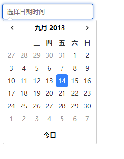

# df-datetimepicker
基于vue开发的日期时间选择组件

## 二次开发
```
git clone https://github.com/zzzzzga/df-datetimepicker.git
cd df-datetimepicker
npm i
npm run dev
```

## 快速使用

### 安装
```
npm i -S df-datetimepicker
```

### 引用
```vue
<template>
  <div>
    ...
    <dfDatetimepicker />
    ...
  </div>
</template>
<script>
import dfDatetimepicker from 'df-datetimepicker'
export default {
  ...
  components: {
    dfDatetimepicker
  },
  ...
}
</script>
```

## 功能介绍
+ 实现简单的日期时间选择
+ TODO: 等待完善


## 效果图


## 关于作者
如果你感觉有收获，欢迎给我打赏 ———— 以激励我更多输出优质开源内容


